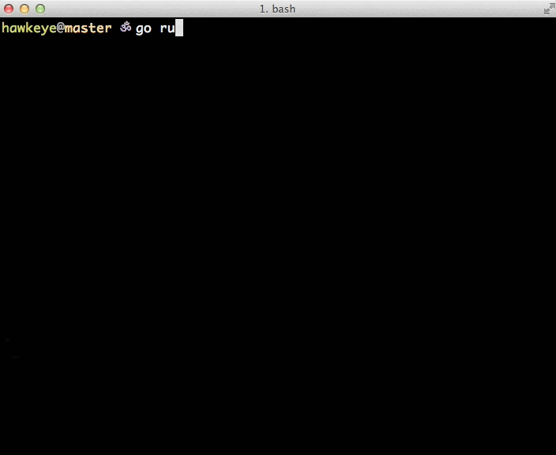

# Hawkeye

A weekend experiment on making a pretty test runner for go.

It's not but a very simple prototype on using go's own ast package to
parse a file, finds its specs and run them.


## playing

**There is a local folder named `foo`** which contains a file called `spec_bar.go`:

```go
package foo
import . "falcao.it/gspec"

func Feature(){
	Describe("The sum operation", func(){
		var number int

		Given("the number 10", func(){
			number = 10
		})
		When("I add 5", func(){
			number += 5
		})

		Then("It should equal 15", func(){
			Expect(number).To.Equal(15)
			It("Should really be 15", func(){
				Expect(number).To.Equal(15)
			})
		})
	})
}
```

**Then you can run like this:**

```bash
go run gspec.go ./foo/
```

**And see the results**


