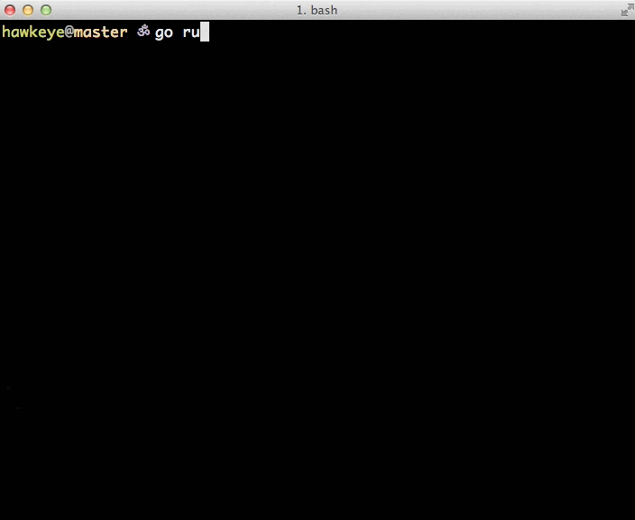

gspec
-----

It started as a weekend experiment on making a pretty test runner for
go, then I started to write some base tests using conventional go test
libraries and building my own assertion based such axioms.

how it works
............

everything is synchronous, I built it for myself so I can have an
efficient TDD flow with unit tests in go. The main idea is to reduce as
much as possible the friction in: writing, running and debugging tests
in go.

playing
.......

**There is a local folder named ``foo``** which contains a file called
``spec_bar.go``:

.. code:: go

   package foo
   import . "github.com/gabrielfalcao/gspec"

   func Feature(){
       Describe("The sum operation", func(){
           var number int

           Given("the number 10", func(){
               number = 10
           })
           When("I add 5", func(){
               number += 5
           })

           Then("It should equal 15", func(){
               Expect(number).To.Equal(15)
               It("Should really be 15", func(){
                   Expect(number).To.Equal(15)
               })
           })
       })
   }

**Then you can run like this:**

.. code:: bash

   go run gspec.go ./foo/

**And see the results**

   example.gif
